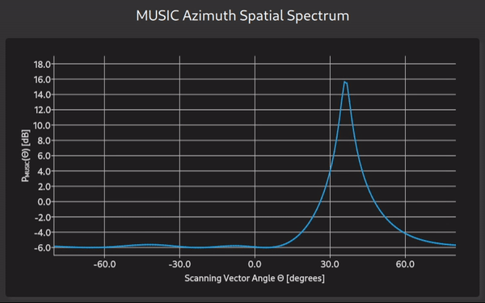
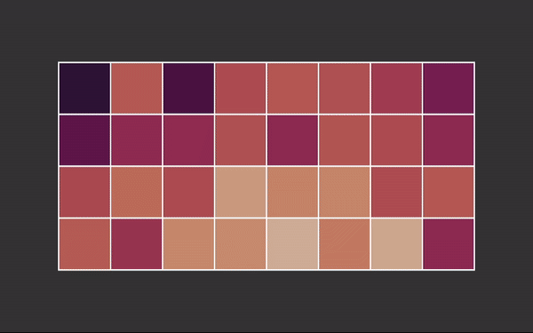

# ESPARGOS Python Client Library + Demos


*pyespargos* is the python library for working with the [ESPARGOS](https://espargos.net/) WiFi channel sounder.
ESPARGOS is a real-time-capable, phase-synchronous 2 &times; 4 WiFi antenna array built from Espressif ESP32 chips that facilities that development and deployment of WiFi sensing applications.

**`pyespargos` is still under development. Currently, only HT40 packets (40MHz wide channels) are supported.**

## Demo Applications
<table style="max-width: 800px;">
	<tr>
		<th style="text-align: center;">MUSIC Spatial spectrum</th>
		<th style="text-align: center;">Receive Signal Phase by Antenna</th>
	</tr>
	<tr>
		<td style="text-align: center;"></td>
		<td style="text-align: center;"></td>
	</tr>
	<tr>
		<th style="text-align: center;">Instantaneous CSI: Frequency Domain</th>
		<th style="text-align: center;">Instantaneous CSI: Time Domain</th>
	</tr>
	<tr>
		<td style="text-align: center;"></td>
		<td style="text-align: center;"></td>
	</tr>
	<tr>
		<th style="text-align: center;">Phases over Time</th>
		<th style="text-align: center;">Combined 8 &times; 4 ESPARGOS Array</th>
	</tr>
	<tr>
		<td style="text-align: center;"></td>
		<td style="text-align: center;"></td>
	</tr>
</table>

*pyespargos* comes with a selection of demo applications for testing ESPARGOS.
The following demos are provided in the `demos` folder of this repository:

* `music-spectrum`: Use the [MUSIC algorithm](https://en.wikipedia.org/wiki/MUSIC_(algorithm)) to display a spatial (angular) spectrum. Demonstrates angle of arrival (AoA) estimation.
* `phases-over-space`: Show the average received phase for each ESPARGOS antenna.
* `instantaneous-csi`: Plot the current frequency-domain or time-domain transfer function of the measured channel.
* `phases-over-time`: Plot the average received phase for every antenna over time.
* `combined-array`: Combine multiple ESPARGOS arrays into one large antenna array and visualize the average received phase for each antenna. Requires multiple ESPARGOS arrays.

Unless otherwise noted, the demos connect to exactly one ESPARGOS antenna array with 2 &times; 4 antennas.

## Installation
* Create a virtual environment for `pyespargos`
```bash
python -m venv ~/pyespargos-venv
```
* Activate the virtual environment. **You will need to execute this every time before running any `pyespargos`-based scripts**:
```bash
. ~/pyespargos-venv/bin/activate
```
* Install `pyespargos` to the new virtual environment with `pip`:
```bash
cd pyespargos
pip install .
```
* If you want to make changes to `pyespargos`, it is recommended to install it in editable mode. This way, if you make changes to the `espargos` library, they are immediately applied without needing to re-install anything:
```bash
sudo pip install -e .
```
* If you want to run the demo applications, you will need to install some additional Python dependencies:
```
pip install pyqt6 pyqt6-charts
```
* Import the `espargos` package in your Python application. Use this minimal sample code to get started:
```python
#!/usr/bin/env python3

import espargos
import time

pool = espargos.Pool([espargos.Board("192.168.1.2")])
pool.start()
pool.calibrate(duration = 2)
backlog = espargos.CSIBacklog(pool, size = 20)
backlog.start()

# Wait for a while to collect some WiFi packets to the backlog...
time.sleep(4)

csi_ht40 = backlog.get_ht40()
print("Received CSI: ", csi_ht40)

backlog.stop()
pool.stop()
```
* Take a look at the demo applications for advanced usage
* To run the demos that come with *pyespargos*, you may need to install additional dependencies that are not listed in `requirements.txt` (most notably, PyQt6-related packages)

## Basics

### WiFi
* ESPARGOS uses the L-LTF and/or HT-LTF fields of 802.11g/n frames to extract channel state information (CSI).
* ESPARGOS is totally passive, it only acts as a receiver in promiscuous mode. It provides CSI for any WiFi frames it receives.
* To receive frames, the transmitter and ESPARGOS must use the same WiFi channel.
* 802.11n supports channel bandwidths of 20MHz and 40MHz. The ESPARGOS hardware and firmware supports both bandwidth configurations, but *pyespargos* currently only works with frames which use 40MHz of bandwidth (known as "HT40").

### Communication between pyespargos and ESPARGOS
* ESPARGOS provides an HTTP / WebSockets API on port 80.
* CSI is streamed in binary format over a WebSocket.
* Control commands are issued via HTTP.

### The Backlog
* The L-LFT and HT-LTF fields used for channel estimation are really short compared to the total length of the WiFi frame.
* This results in really noisy CSI estimates.
* Therefore, it is a good idea to average CSI over multiple WiFi packets.
* To this end, *pyespargos* offers a *backlog* functionality, where CSI from the last N packets is cached. The backlog is implemented as a ringbuffer.
* To obtain higher-quality CSI, you may use the CSI interpolation helpers in `espargos/util.py`.

### Calibration
* ESPARGOS is based on phase-synchronized ESP32 SoCs. Phase synchronization is achieved in two steps:

	- All ESP32 chips are clocked from the same 40MHz reference clock, which makes them frequency-synchronous.
	- To correct for PLL phase ambiguity a WiFi frames is distributed to all ESP32 chips over a known channel (microstrip traces of known length on the PCB).

* Now we know the initial phase of the local oscillator (LO) signal on every ESP32.
* With *pyespargos*, this calibration can be performed with just one command: `pool.calibrate()`
* In our observations, this initial phase offset between antennas remains relatively static over time, so one calibration of ESPARGOS should be sufficient.
* Additionally, we we can obtain very precise packet reception timestamps, which provides time synchronization.

## Additional Non-Public Demo Applications
* `dataset-recorder`: Application to record ESPARGOS datasets for publication on [https://espargos.net/datasets/](https://espargos.net/datasets/). Please contact me to get access.
* `realtime-localization`: Real-time Localization Demo: Channel Charting vs. Triangulation vs. Supervised Training. Requires multiple ESPARGOS. Please contact me to get access.
<p>
	
</p>

## License
`pyespargos` is licensed under the GNU Lesser General Public License version 3 (LGPLv3), see `LICENSE` for details.