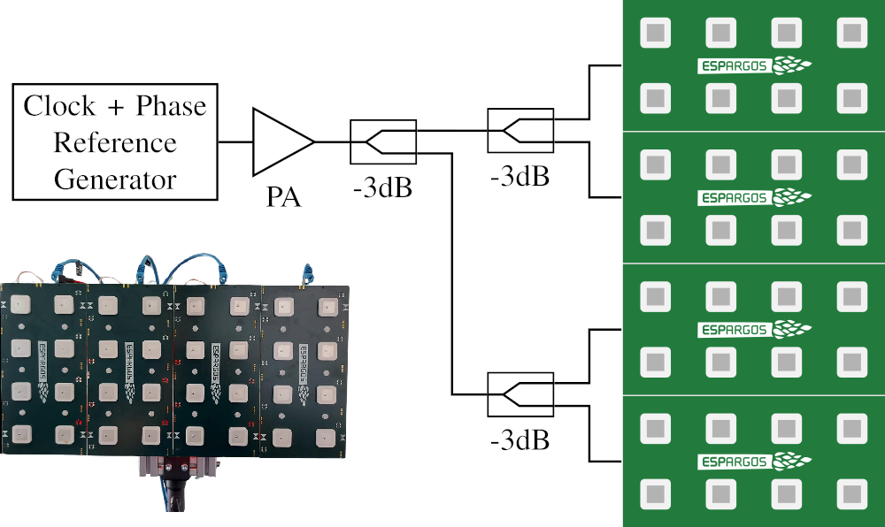

Combined Arrays
===============

You can combine multiple ESPARGOS devices with 2 × 4 antennas into one larger phase-synchronous antenna array.
The combined array can be made phase-synchronous across the devices if all ESPARGOS arrays are connected to the same reference signal generator.
This page describes how to configure multiple ESPARGOS devices for phase-coherent operation.
If you don't need phase-coherent operation, there is no need to follow these instructions.

   Four ESPARGOS antenna arrays combined into one larger array, all connected to the same reference signal generator.

Hardware Setup
--------------
Every ESPARGOS controller integrates a reference signal generator that produces the frequency-multiplexed clock and phase synchronization signals.
By default, the output of the controller is connected to the reference signal input of the sensor board so that only all antennas within that array are phase-synchronous.

To combine multiple ESPARGOS devices into one larger array, you need to connect all ESPARGOS devices to the same reference signal generator, i.e., the same controller.
Arbitrarily select on of the controllers as the main controller that generates the reference signal for the whole array.
Take the output signal of the main controller use a cascade of RF power splitters (or one N-port power splitter) to distribute the reference signal to all sensor boards.
The power splitters need to be sufficiently wideband to pass both the clock signal at 40 MHz and the phase reference signal at 2.4-2.5 GHz without significant attenuation or distortion.
They also should also should not introduce any phase unbalance between the output ports, or at least phase unbalance that is so small that it can be neglected.

You may use resistive power splitters (cheap, wideband, lossy) or specialized RF devices like `Wilkinson power dividers <https://en.wikipedia.org/wiki/Wilkinson_power_divider>`_ (expensive, but less loss).
In any case, you must make sure that the signal power (especially the power of the clock signal, the phase reference signal is less critical) at the input of each ESPARGOS sensor board is sufficient to ensure stable operation.
If you use a resistive power splitters or you combine more than two arrays, you will need to use a suitable wide-band RF power amplifier, which can both amplify the clock signal at 40 MHz and the phase reference signal at 2.4-2.5 GHz.
For example, for the setup shown in the figure with 4 ESPARGOS arrays, we used a `Mini-Circuits ZX60-V83-S+ <https://minicircuits.com/WebStore/dashboard.html?model=ZX60-V83-S%2B>`_ power amplifier and three `Mini-Circuits ZN2PD2-50-S+ <https://www.minicircuits.com/WebStore/dashboard.html?model=ZN2PD2-50-S%2B>`_ Wilkinson power dividers, which pass the 40 MHz clock signal just fine.

.. note::
   If your phase measurements appear noisy or unstable, this may be caused by the amplitude of the clock signal being too low.
   Make sure to choose a suitable power amplifier to boost the clock signal to the desired level.
   A voltage level of 1 Vpp at the input of each ESPARGOS is definitely sufficient.
   Make sure not to exceed 3.3 Vpp.

Software Setup
--------------

Make the following configuration changes in the web interface of the ESPARGOS controllers of the combined array:

* **For the main controller**, set the *Generate Phase Reference* option to *During calibration*
* **For all other controllers**, set the *Generate Phase Reference* option to *Never*

This way, the main controller will generate the phase reference signal for the whole array, and all other controllers will never generate any phase reference signal, so there is no danger of RF leakage of that signal at the non-terminated output.

.. note::
   Switching to calibration mode (e.g., by running :code:`Pool.calibrate` or in the web interface) on any controller other than the main controller will now only show phase reference packets if the main controller is also in calibration mode.

To obtain phase-coherent CSI data from the combined array, you can use the following code snippet:

.. code-block:: python

  import espargos
  import time

  pool = espargos.Pool([
   espargos.Board("192.168.1.2"),
   espargos.Board("192.168.1.3"),
   espargos.Board("192.168.1.4"),
   espargos.Board("192.168.1.5")
  ])
  pool.start()
  pool.calibrate(
   duration = 2,
   per_board = False,
   cable_lengths = [0.4, 0.4, 0.8, 0.8],
   cable_velocity_factors = [0.76, 0.76, 0.76, 0.76]
  )
  backlog = espargos.CSIBacklog(pool, size = 20)
  backlog.start()

  # Wait for a while to collect some WiFi packets to the backlog...
  time.sleep(4)

  print("Received CSI of shape: ", backlog.get_ht40().shape)

  backlog.stop()
  pool.stop()

In this example, we create a pool of four ESPARGOS boards by passing a list of four :class:`.Board` instances to the :class:`.Pool` constructor.
The important change is to call the :meth:`.Pool.calibrate` method with the *per_board* parameter set to *False*, which means that the phase calibration is performed globally across all arrays and not per-board.
This requires all ESPARGOS devices to be connected to the same phase reference signal generator so that all sensors receive the same phase reference signal packets.

The optional *cable_lengths* and *cable_velocity_factors* parameters are used to compensate for potentially different cable lengths between the ESPARGOS devices and the power splitters.
If your cables are all the same length, you can omit these parameters.
If your cables are different lengths, you should measure / calculate the sum of all cable lengths between the signal generator and the ESPARGOS devices and provide these values in the *cable_lengths* list.
You can usually look up the velocity factor in the datasheet of the coaxial cable.